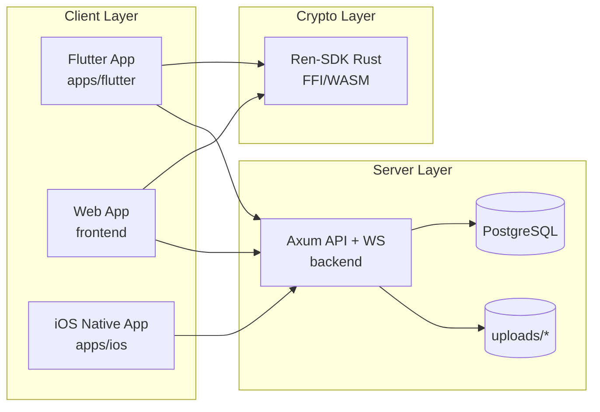
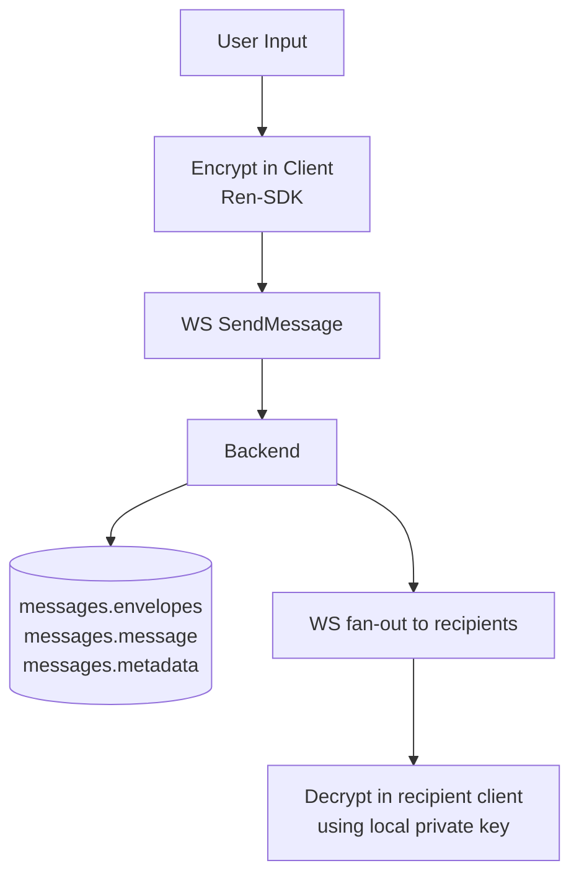
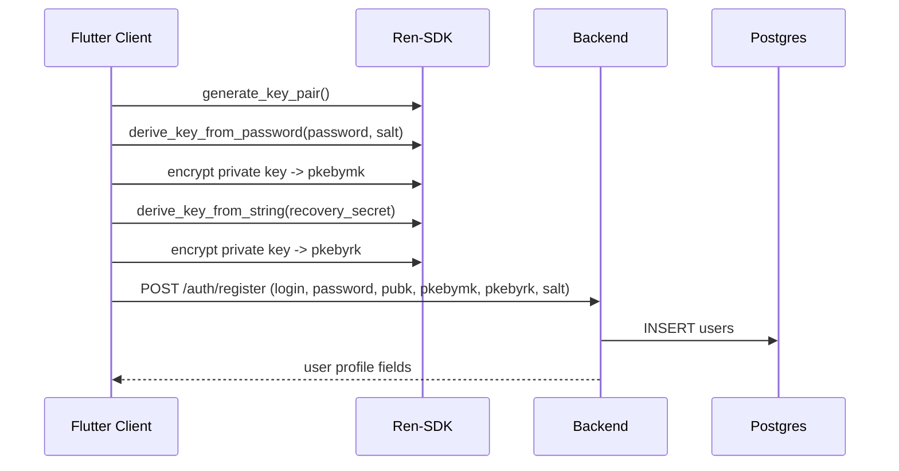
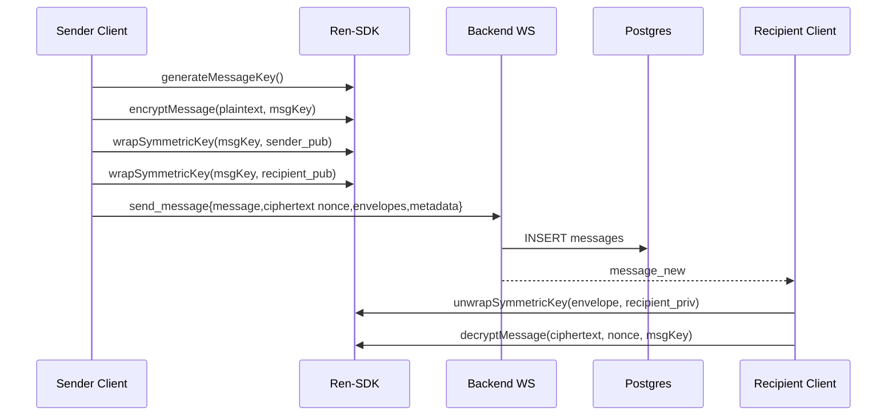
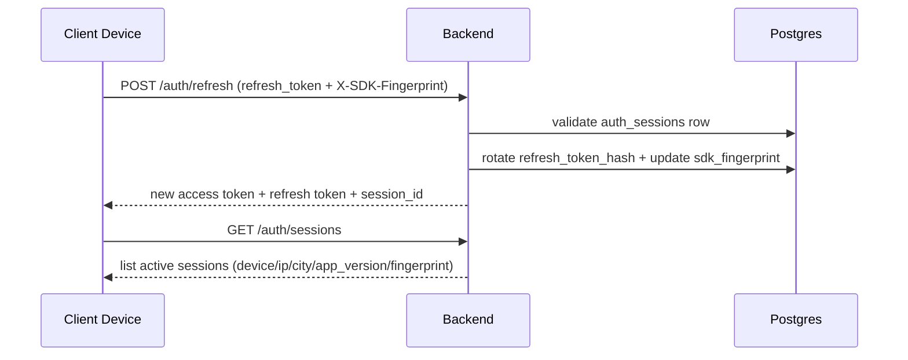

# Architecture

## System Components

## Runtime Architecture
- Flutter client uses `RenSdk` (`apps/flutter/lib/core/sdk/ren_sdk.dart`) for local cryptographic operations.
- Backend (`backend/src/main.rs`) exposes HTTP + WebSocket routes, validates JWT sessions, and stores encrypted payloads.
- Postgres stores users, chats, messages, auth sessions, and metadata.
- Binary media ciphertext is stored on disk under `backend/uploads` via `/media` endpoints.

## Trust Boundaries
- Boundary A: Device <-> API transport (TLS expected in deployment).
- Boundary B: API <-> PostgreSQL.
- Boundary C: API <-> filesystem uploads.
- Boundary D: Local secure storage on device (private key/token/session).

## Data Flow (High Level)

## Sequence: Registration

## Sequence: Private Message Send

## Sequence: Device Session Refresh / Device Change

## Fault Points
- SDK integrity mismatch on Android blocks startup (`RenSdk.initialize`).
- Missing/invalid fingerprint when allowlist enabled causes 401 on auth/session validation.
- Media file persistence depends on local filesystem availability in backend container.
- WebSocket state recovery relies on client reconnect logic.

## Scalability Notes
- Single-process in-memory WS hubs (`DashMap`) imply state is local to one backend instance.
- Horizontal scaling requires shared pub/sub for cross-node WS fan-out.
- DB connection pool configured at startup (`max_connections(10)`) and may require tuning.

## Technical Debt (from code)
- Group/channel messages are non-E2EE by design today.
- Double Ratchet and Sender Keys are planned docs, not production implementation.
- Public key “signature” endpoint currently uses hash-based placeholder, not full Ed25519 verification chain.
