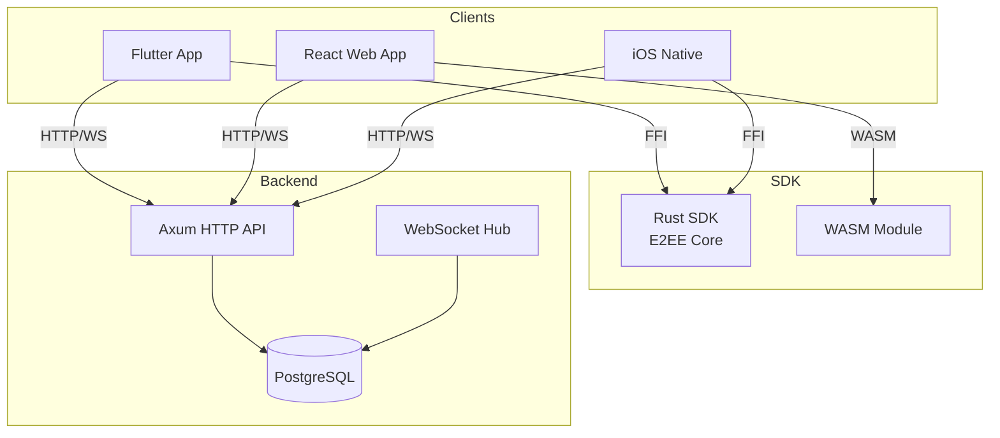
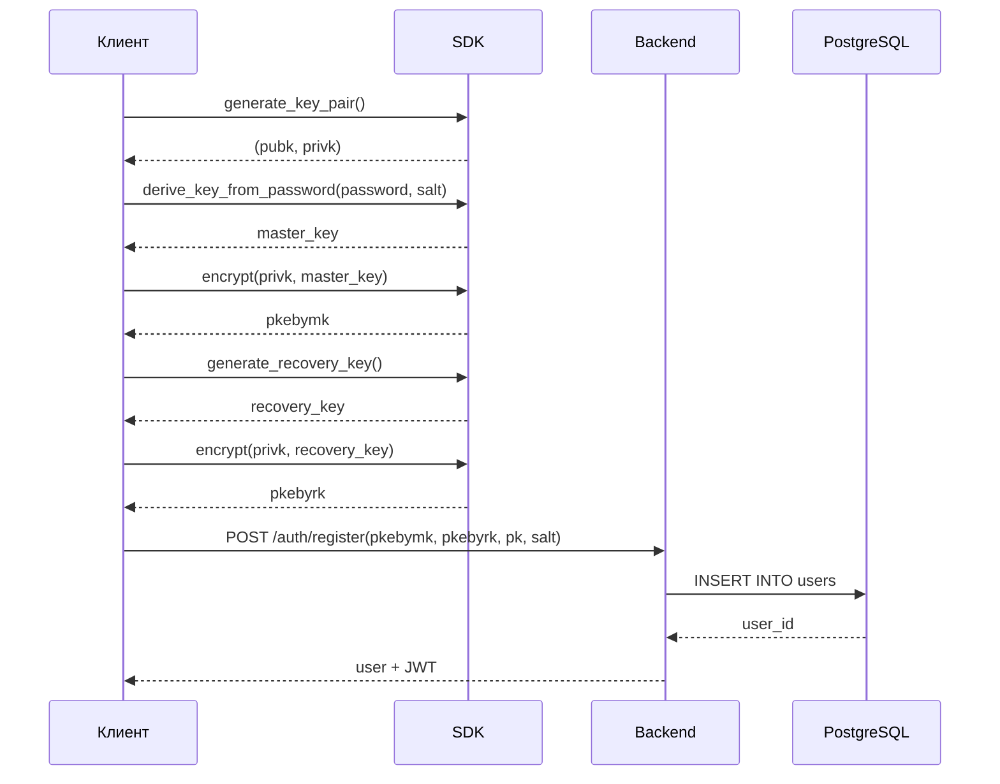
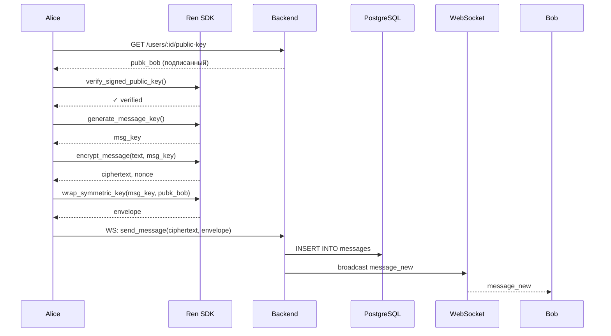
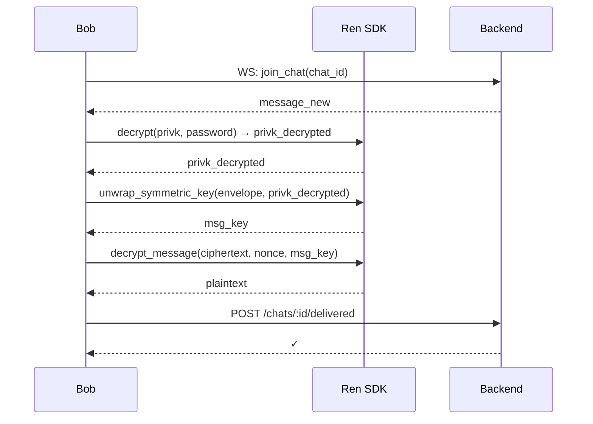

# Архитектура

## Обзор

Ren — кроссплатформенный мессенджер со сквозным шифрованием. Архитектура построена вокруг единого Rust SDK, который предоставляет криптографические функции для всех платформ.



## Компоненты

### Ren-SDK (Rust)

**Расположение:** `Ren-SDK/`

**Назначение:** Ядро шифрования для всех платформ.

**Функции:**

| Функция | Описание |
|---------|----------|
| `generate_key_pair()` | Генерация пары ключей X25519 |
| `generate_message_key()` | Генерация симметричного ключа |
| `encrypt_message()` | Шифрование сообщения (ChaCha20-Poly1305) |
| `decrypt_message()` | Расшифровка сообщения |
| `wrap_symmetric_key()` | Обёртка ключа публичным ключом (ECDH) |
| `unwrap_symmetric_key()` | Распаковка ключа приватным ключом |
| `derive_key_from_password()` | PBKDF2-HMAC-SHA256 деривация |
| `generate_identity_key_pair()` | Ed25519 ключи для подписи |
| `sign_public_key()` | Подпись публичного ключа |
| `verify_signed_public_key()` | Верификация подписи |

**Структура:**

```
Ren-SDK/
├── src/
│   ├── crypto.rs      # Криптографические операции
│   ├── types/
│   │   └── mod.rs     # Типы данных
│   ├── ffi.rs         # C ABI биндинги (iOS, Android, Flutter)
│   ├── wasm.rs        # WebAssembly биндинги (React)
│   └── lib.rs         # Главная библиотека
├── build.sdk.sh       # Скрипт сборки (macOS/Linux)
├── build.sdk.ps1      # Скрипт сборки (Windows)
└── Cargo.toml
```

**Криптография:**

| Алгоритм | Назначение |
|----------|------------|
| X25519 | ECDH для обмена ключами |
| Ed25519 | Подпись публичных ключей |
| ChaCha20-Poly1305 | AEAD шифрование |
| PBKDF2-HMAC-SHA256 | Деривация ключа из пароля (100k итераций) |
| Argon2id | Деривация ключа восстановления (memory-hard) |
| HKDF-SHA256 | Деривация ключей обёртки |

### Backend (Rust/Axum)

**Расположение:** `backend/`

**Назначение:** HTTP API + WebSocket сервер.

**Компоненты:**

```
backend/
├── src/
│   ├── main.rs        # Точка входа, инициализация
│   ├── route/
│   │   ├── auth.rs    # Регистрация, вход, refresh
│   │   ├── users.rs   # Профиль, поиск, публичные ключи
│   │   ├── chats.rs   # Чаты, сообщения, участники
│   │   ├── media.rs   # Загрузка/скачивание файлов
│   │   └── ws.rs      # WebSocket обработчик
│   ├── models/
│   │   ├── auth.rs    # Модели аутентификации
│   │   ├── chats.rs   # Модели чатов
│   │   └── users.rs   # Модели пользователей
│   └── middleware/
│       ├── auth.rs    # JWT аутентификация
│       ├── logging.rs # Логирование запросов
│       └── rate_limit.rs # Rate limiting
├── migrations/        # SQL миграции
└── Cargo.toml
```

**Технологии:**

| Технология | Версия | Назначение |
|------------|--------|------------|
| Axum | 0.7 | HTTP/WebSocket фреймворк |
| Tokio | 1.x | Асинхронный runtime |
| SQLx | 0.7 | Типобезопасный PostgreSQL клиент |
| DashMap | 5 | Concurrent HashMap для WebSocket хабов |
| jsonwebtoken | 9 | JWT обработка |
| Argon2 | 0.5 | Хеширование паролей |

**База данных:**

```mermaid
erDiagram
    users ||--o{ chats : "participate in"
    users ||--o{ messages : "send"
    users ||--o{ chat_participants : "join"
    chats ||--o{ chat_participants : "have"
    chats ||--o{ messages : "contain"

    users {
        int id PK
        string login UK
        string username UK
        string nickname
        string avatar
        string password_hash
        string pkebymk "E2EE: encrypted by master key"
        string pkebyrk "E2EE: encrypted by recovery key"
        string salt
        string pk "X25519 public key"
        string identity_pubk "Ed25519 identity key"
    }

    chats {
        int id PK
        string kind "private|group|channel"
        string title
        timestamptz created_at
        timestamptz updated_at
        string avatar
        int user_a "private chats only"
        int user_b "private chats only"
    }

    chat_participants {
        int chat_id PK,FK
        int user_id PK,FK
        string role "member|admin|owner"
        timestamptz joined_at
        int last_read_message_id
        boolean is_muted
    }

    messages {
        int id PK
        int chat_id FK
        int sender_id FK
        string message "E2EE ciphertext"
        string message_type "text|file|image|voice|video"
        timestamptz created_at
        timestamptz edited_at
        boolean is_read
        boolean is_delivered
        jsonb envelopes "E2EE: per-recipient key wraps"
        jsonb metadata "File metadata"
        uuid client_message_id "Anti-replay"
    }
```

### Flutter App

**Расположение:** `apps/flutter/`

**Архитектура:** Clean Architecture

```
apps/flutter/
├── lib/
│   ├── features/
│   │   ├── auth/
│   │   │   ├── domain/      # Модели, репозитории
│   │   │   ├── data/        # API клиенты
│   │   │   └── presentation/# UI компоненты
│   │   ├── chats/
│   │   └── profile/
│   ├── core/
│   │   ├── sdk/             # Ren SDK FFI
│   │   ├── network/         # HTTP/WebSocket клиенты
│   │   ├── cryptography/    # E2EE логика
│   │   └── cache/           # Локальное кэширование
│   └── main.dart
└── pubspec.yaml
```

**Интеграция SDK:**

```dart
// Загрузка нативной библиотеки
final lib = DynamicLibrary.open('libren_sdk.so'); // Android
final lib = DynamicLibrary.process(); // iOS

// FFI биндинги
typedef RenGenerateKeyPair = ffi.Pointer<RenKeyPair> Function();
typedef GenerateKeyPair = RenKeyPair Function();

final generateKeyPair = lib
    .lookup<ffi.NativeFunction<RenGenerateKeyPair>>('ren_generate_key_pair')
    .asFunction<GenerateKeyPair>();
```

**Хранение данных:**

| Данные | Хранилище |
|--------|-----------|
| JWT токен | flutter_secure_storage |
| Приватный ключ | flutter_secure_storage |
| Сообщения/чаты | In-memory + кэш на диске |
| Файлы | Временная директория (кэш) |

### Frontend (React/WASM)

**Расположение:** `frontend/`

**Технологии:**

| Технология | Назначение |
|------------|------------|
| React 19 | UI библиотека |
| TypeScript 5.9 | Типизация |
| Vite 7.2 | Сборщик |
| Tailwind CSS 4.1 | Стилизация |
| Radix UI | Доступные компоненты |
| WASM | Ren SDK для браузера |

**Структура:**

```
frontend/
├── src/
│   ├── Pages/         # Страницы (Login, Register, Home)
│   ├── components/    # UI компоненты
│   ├── services/      # API клиенты
│   ├── context/       # React Context
│   └── lib/           # WASM SDK
└── package.json
```

## Взаимодействие компонентов

### Регистрация пользователя



### Отправка сообщения



### Получение сообщения



## Безопасность

### E2EE поток

1. **Генерация ключей:** X25519 key pair на устройстве
2. **Обмен ключами:** Публичный ключ на сервере, приватный никогда не покидает устройство
3. **Шифрование:** ChaCha20-Poly1305 AEAD
4. **Конверты:** Ключ сообщения обёрнут публичным ключом получателя
5. **Подпись ключей:** Ed25519 signature для верификации (P0-2)

### Хранение данных

| Данные | Сервер | Клиент |
|--------|--------|--------|
| Пароль | Argon2id hash | Никогда не хранится |
| Приватный ключ | Зашифрованный (pkebymk/pkebyrk) | Расшифрованный в памяти |
| Сообщения | Зашифрованные | Расшифрованные в памяти |
| Файлы | Зашифрованные | Кэш на диске (зашифрованный) |

### Известные ограничения

> **P0-5:** Групповые/каналные сообщения **НЕ защищены E2EE**. Сервер имеет доступ к plaintext. План исправления: Sender Keys protocol.

## Масштабирование

### WebSocket хаб

Используется `DashMap<i32, broadcast::Sender<String>>` для per-chat каналов:

```rust
pub ws_hub: Arc<DashMap<i32, broadcast::Sender<String>>>,
pub user_hub: Arc<DashMap<i32, broadcast::Sender<String>>>,
```

### Rate limiting

P1-7: Реализован middleware `RateLimiter` с IP + account bucketing:

```rust
pub rate_limiter: middleware::RateLimiter,
pub auth_rate_limiter: middleware::AuthRateLimiter,
```

## Развёртывание

### Docker Compose

```yaml
services:
  backend:
    image: rust:latest
    depends_on:
      - db
  db:
    image: postgres:16
  nginx:
    image: nginx:alpine
    ports:
      - "80:80"
      - "443:443"
```

См. [Deployment](/docs/deployment) для подробных инструкций.
