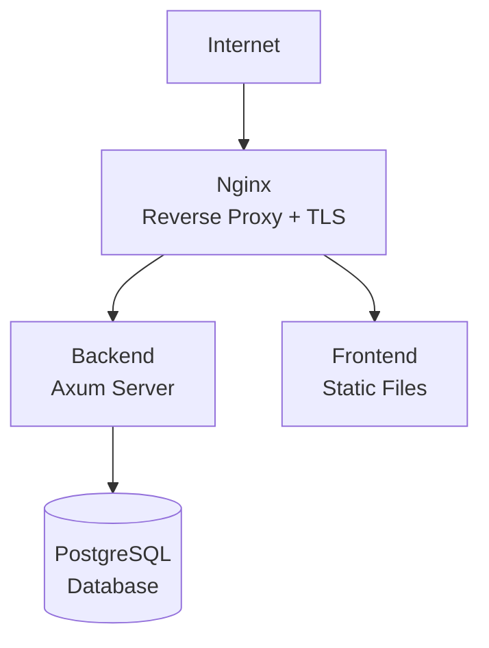

# Развёртывание

Это руководство описывает процесс развёртывания Ren в продакшен-окружении.

## Требования

| Компонент | Версия | Примечание |
|-----------|--------|------------|
| **Docker** | 20+ | Для контейнеризации |
| **Docker Compose** | 2.0+ | Для оркестрации |
| **PostgreSQL** | 14+ | База данных |
| **Nginx** | 1.20+ | Reverse proxy |
| **SSL сертификат** | Let's Encrypt | Для HTTPS |

## Архитектура развёртывания



## Шаг 1: Подготовка сервера

### Минимальные требования

| Ресурс | Значение |
|--------|----------|
| **CPU** | 2 cores |
| **RAM** | 4 GB |
| **Disk** | 20 GB SSD |
| **OS** | Ubuntu 20.04+ / Debian 11+ |

### Установка Docker

```bash
# Ubuntu/Debian
curl -fsSL https://get.docker.com -o get-docker.sh
sudo sh get-docker.sh

# Добавить пользователя в группу docker
sudo usermod -aG docker $USER
newgrp docker

# Проверка
docker --version
docker compose version
```

## Шаг 2: Клонирование проекта

```bash
git clone https://github.com/taiidzy/ren.git
cd ren
```

## Шаг 3: Настройка переменных окружения

Создайте файл `.env` в корне проекта:

```env
# PostgreSQL
POSTGRES_USER=ren_user
POSTGRES_PASSWORD=<secure-password>
POSTGRES_DB=ren_messenger
POSTGRES_HOST=db
POSTGRES_PORT=5432

# JWT
JWT_SECRET=<32-byte-random-secret>

# Domain
DOMAIN=messanger-ren.ru
LETSENCRYPT_EMAIL=admin@example.com

# Security
SDK_FINGERPRINT_ALLOWLIST=
CORS_ALLOW_ORIGINS=https://messanger-ren.ru,https://www.messanger-ren.ru
```

### Генерация безопасных секретов

```bash
# JWT_SECRET (32 байта)
openssl rand -base64 32

# PostgreSQL password
openssl rand -base64 32
```

## Шаг 4: Настройка Nginx для Let's Encrypt

### Создание директорий

```bash
mkdir -p nginx/certbot/www
mkdir -p nginx/certbot/conf
mkdir -p nginx/var/www
```

### Конфигурация Nginx

Отредактируйте `nginx/nginx.conf`:

```nginx
server {
    listen 80;
    server_name messanger-ren.ru www.messanger-ren.ru;

    # ACME challenge для Let's Encrypt
    location /.well-known/acme-challenge/ {
        root /var/www/certbot;
    }

    # Redirect HTTP -> HTTPS
    location / {
        return 301 https://$server_name$request_uri;
    }
}

server {
    listen 443 ssl http2;
    server_name messanger-ren.ru www.messanger-ren.ru;

    # SSL сертификаты
    ssl_certificate /etc/letsencrypt/live/messanger-ren.ru/fullchain.pem;
    ssl_certificate_key /etc/letsencrypt/live/messanger-ren.ru/privkey.pem;

    # TLS hardening
    include /etc/nginx/options-ssl-nginx.conf;
    ssl_dhparam /etc/nginx/dhparam.pem;

    # Security headers
    add_header Strict-Transport-Security "max-age=63072000; includeSubDomains; preload" always;
    add_header X-Frame-Options "SAMEORIGIN" always;
    add_header X-Content-Type-Options "nosniff" always;
    add_header X-XSS-Protection "1; mode=block" always;
    add_header Referrer-Policy "strict-origin-when-cross-origin" always;

    # Backend API
    location /api/ {
        proxy_pass http://backend:8081/;
        proxy_http_version 1.1;
        proxy_set_header Upgrade $http_upgrade;
        proxy_set_header Connection "upgrade";
        proxy_set_header Host $host;
        proxy_set_header X-Real-IP $remote_addr;
        proxy_set_header X-Forwarded-For $proxy_add_x_forwarded_for;
        proxy_set_header X-Forwarded-Proto $scheme;
    }

    # WebSocket
    location /ws {
        proxy_pass http://backend:8081/ws;
        proxy_http_version 1.1;
        proxy_set_header Upgrade $http_upgrade;
        proxy_set_header Connection "upgrade";
        proxy_set_header Host $host;
        proxy_set_header X-Real-IP $remote_addr;
    }

    # Frontend static files
    location / {
        root /var/www/messanger-ren.ru;
        try_files $uri $uri/ /index.html;
    }
}
```

## Шаг 5: Получение SSL сертификата

```bash
# Запуск Certbot
docker-compose run --rm certbot

# Генерация DH параметров (единожды)
openssl dhparam -out ./nginx/dhparam.pem 2048
```

## Шаг 6: Сборка Ren-SDK

```bash
cd Ren-SDK
chmod +x build.sdk.sh
./build.sdk.sh
```

## Шаг 7: Сборка frontend

```bash
cd frontend

# Установите зависимости
npm install

# Соберите для продакшена
VITE_API_URL=https://messanger-ren.ru \
VITE_WS_URL=wss://messanger-ren.ru \
npm run build

# Скопируйте артефакты
cp -r dist/* ../nginx/var/www/
```

## Шаг 8: Запуск сервисов

```bash
# Запуск всех сервисов
docker-compose up -d

# Проверка статуса
docker-compose ps

# Просмотр логов
docker-compose logs -f backend
```

## Шаг 9: Проверка развёртывания

```bash
# Проверка health endpoint
curl https://messanger-ren.ru/api/health

# Проверка WebSocket
wscat -c wss://messanger-ren.ru/ws

# Проверка frontend
curl https://messanger-ren.ru
```

## Мониторинг

### Логи

```bash
# Backend логи
docker-compose logs -f backend

# Nginx логи
docker exec -it <nginx_container> tail -f /var/log/nginx/access.log
docker exec -it <nginx_container> tail -f /var/log/nginx/error.log

# PostgreSQL логи
docker-compose logs -f db
```

### Метрики

> TODO: Добавить интеграцию с Prometheus/Grafana

### Health checks

```bash
# Health endpoint
curl https://messanger-ren.ru/api/health

# Database connection
docker exec -it <db_container> psql -U ren_user -d ren_messenger -c "SELECT 1"
```

## Масштабирование

### Горизонтальное масштабирование backend

```yaml
# docker-compose.override.yml
services:
  backend:
    deploy:
      replicas: 3
      resources:
        limits:
          cpus: '1'
          memory: 1G
```

### Репликация PostgreSQL

> TODO: Добавить конфигурацию репликации

## Резервное копирование

### PostgreSQL backup

```bash
# Создать backup скрипт
cat > backup.sh << 'EOF'
#!/bin/bash
DATE=$(date +%Y%m%d_%H%M%S)
docker exec db pg_dump -U ren_user ren_messenger > /backups/backup_$DATE.sql
# Хранить последние 7 бэкапов
find /backups -name "backup_*.sql" -mtime +7 -delete
EOF

chmod +x backup.sh

# Добавить в crontab (ежедневно в 3:00)
crontab -e
0 3 * * * /path/to/backup.sh
```

### Восстановление из backup

```bash
docker exec -i db psql -U ren_user -d ren_messenger < /backups/backup_YYYYMMDD_HHMMSS.sql
```

## Обновление

```bash
# Остановить сервисы
docker-compose down

# Обновить код
git pull

# Пересобрать SDK (если были изменения)
cd Ren-SDK && ./build.sdk.sh

# Запустить миграции и сервисы
docker-compose up -d

# Проверить логи
docker-compose logs -f backend
```

## Безопасность

### Firewall

```bash
# UFW (Ubuntu)
sudo ufw allow 22/tcp    # SSH
sudo ufw allow 80/tcp    # HTTP (для Let's Encrypt)
sudo ufw allow 443/tcp   # HTTPS
sudo ufw enable
```

### Fail2ban

```bash
sudo apt install fail2ban
sudo systemctl enable fail2ban
sudo systemctl start fail2ban
```

### Автоматические обновления

```bash
# Ubuntu
sudo apt install unattended-upgrades
sudo dpkg-reconfigure --priority=low unattended-upgrades
```

## Troubleshooting

### Backend не запускается

```bash
# Проверить логи
docker-compose logs backend

# Проверить подключение к БД
docker exec -it backend ping db
```

### SSL сертификат не обновляется

```bash
# Принудительное обновление
docker-compose run --rm certbot renew
```

### WebSocket не подключается

Проверьте Nginx конфигурацию:

```nginx
proxy_set_header Upgrade $http_upgrade;
proxy_set_header Connection "upgrade";
```

## Следующие шаги

- [Troubleshooting](/docs/reference/troubleshooting) — типичные проблемы и решения
- [FAQ](/docs/reference/faq) — часто задаваемые вопросы
