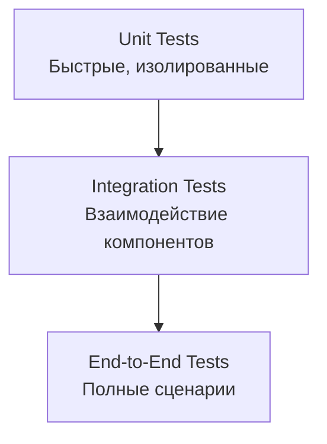

# Тестирование

Это руководство описывает стратегию тестирования и процесс запуска тестов в Ren.

## Стратегия тестирования

Ren использует многоуровневую стратегию тестирования:



### Уровни тестирования

| Уровень | Описание | Покрытие | Скорость |
|---------|----------|----------|----------|
| **Unit** | Тестирование отдельных функций/методов | 80%+ | Быстро (&lt;1с) |
| **Integration** | Тестирование взаимодействия компонентов | 60%+ | Средне (&lt;10с) |
| **E2E** | Тестирование полных пользовательских сценариев | 40%+ | Медленно (&gt;10с) |

## Backend тестирование

### Запуск тестов

```bash
cd backend

# Все тесты
cargo test

# Тесты с выводом
cargo test -- --nocapture

# Конкретный тест
cargo test test_name

# Тесты модуля
cargo test --lib route::auth

# Тесты с покрытием
cargo tarpaulin --out Html
```

### Структура тестов

```rust
#[cfg(test)]
mod tests {
    use super::*;

    #[tokio::test]
    async fn test_registration() {
        // Arrange
        let db = setup_test_db().await;

        // Act
        let result = register_user(&db, "test", "password").await;

        // Assert
        assert!(result.is_ok());
    }
}
```

### Интеграционные тесты

```rust
#[tokio::test]
async fn test_e2e_message_flow() {
    // Setup
    let app = create_test_app().await;

    // Register Alice
    let alice = register_user(&app, "alice", "password").await;

    // Register Bob
    let bob = register_user(&app, "bob", "password").await;

    // Alice sends message to Bob
    let message = send_message(&app, alice.token, bob.id, "Hello").await;

    // Bob receives message
    let received = get_messages(&app, bob.token).await;
    assert_eq!(received.len(), 1);
}
```

### Моки и фикстуры

```rust
// test_utils.rs
pub struct TestDb {
    pub pool: PgPool,
}

impl TestDb {
    pub async fn new() -> Self {
        let pool = create_test_pool().await;
        run_migrations(&pool).await;
        Self { pool }
    }

    pub async fn cleanup(&self) {
        truncate_all_tables(&self.pool).await;
    }
}
```

## Flutter тестирование

### Запуск тестов

```bash
cd apps/flutter

# Все тесты
flutter test

# Тесты с покрытием
flutter test --coverage

# Просмотр покрытия
genhtml coverage/lcov.info -o coverage/html
open coverage/html/index.html

# Конкретный тест
flutter test test/unit/my_test.dart
```

### Unit тесты

```dart
// test/unit/crypto_test.dart
import 'package:flutter_test/flutter_test.dart';
import 'package:ren/core/cryptography/crypto_service.dart';

void main() {
  group('CryptoService', () {
    test('generateKeyPair returns valid keys', () {
      final keyPair = CryptoService.generateKeyPair();

      expect(keyPair.publicKey, isNotEmpty);
      expect(keyPair.privateKey, isNotEmpty);
      expect(keyPair.publicKey.length, 32);
    });

    test('encrypt/decrypt roundtrip', () {
      final message = 'Hello, World!';
      final key = CryptoService.generateMessageKey();

      final encrypted = CryptoService.encrypt(message, key);
      final decrypted = CryptoService.decrypt(encrypted, key);

      expect(decrypted, equals(message));
    });
  });
}
```

### Widget тесты

```dart
// test/widgets/chat_message_bubble_test.dart
import 'package:flutter_test/flutter_test.dart';
import 'package:ren/features/chats/presentation/widgets/chat_message_bubble.dart';

void main() {
  testWidgets('ChatMessageBubble displays message', (tester) async {
    await tester.pumpWidget(
      MaterialApp(
        home: ChatMessageBubble(
          message: ChatMessage(
            id: 1,
            body: 'Hello!',
            isOutgoing: true,
          ),
        ),
      ),
    );

    expect(find.text('Hello!'), findsOneWidget);
    expect(find.byIcon(check), findsOneWidget);
  });
}
```

### Integration тесты

```dart
// test/integration/auth_flow_test.dart
import 'package:flutter_test/flutter_test.dart';
import 'package:integration_test/integration_test.dart';

void main() {
  IntegrationTestWidgetsFlutterBinding.ensureInitialized();

  testWidgets('Full registration flow', (tester) async {
    await tester.pumpWidget(RenApp());

    // Tap register
    await tester.tap(find.text('Register'));
    await tester.pumpAndSettle();

    // Enter details
    await tester.enterText(find.byKey(Key('login')), 'testuser');
    await tester.enterText(find.byKey(Key('username')), 'test');
    await tester.enterText(find.byKey(Key('password')), 'password123');

    // Submit
    await tester.tap(find.text('Create Account'));
    await tester.pumpAndSettle();

    // Verify success
    expect(find.text('Recovery Key'), findsOneWidget);
  });
}
```

## Frontend тестирование

### Запуск тестов

```bash
cd frontend

# Все тесты
npm test

# Watch режим
npm run test:watch

# Покрытие
npm run test:coverage
```

### Unit тесты (Vitest)

```typescript
// test/crypto.test.ts
import { describe, it, expect } from 'vitest';
import { encryptMessage, decryptMessage } from '../lib/sdk';

describe('Crypto', () => {
  it('encrypts and decrypts message', () => {
    const message = 'Hello!';
    const key = generateMessageKey();

    const encrypted = encryptMessage(message, key);
    const decrypted = decryptMessage(encrypted.ciphertext, encrypted.nonce, key);

    expect(decrypted).toBe(message);
  });
});
```

### Component тесты (React Testing Library)

```typescript
// test/components/ChatPage.test.tsx
import { render, screen, fireEvent } from '@testing-library/react';
import ChatPage from '../Pages/ChatPage';

describe('ChatPage', () => {
  it('displays messages', () => {
    render(<ChatPage messages={[{ id: 1, body: 'Hello!' }]} />);

    expect(screen.getByText('Hello!')).toBeInTheDocument();
  });

  it('sends message on submit', () => {
    const onSend = vi.fn();
    render(<ChatPage onSend={onSend} />);

    fireEvent.change(screen.getByPlaceholderText('Message'), {
      target: { value: 'Test' },
    });
    fireEvent.click(screen.getByText('Send'));

    expect(onSend).toHaveBeenCalledWith('Test');
  });
});
```

## Security тестирование

### Криптографические тесты

```rust
#[test]
fn test_key_generation_entropy() {
    let key1 = generate_key_pair();
    let key2 = generate_key_pair();

    // Keys should be unique
    assert_ne!(key1.public, key2.public);
    assert_ne!(key1.private, key2.private);

    // Statistical randomness test
    assert_has_sufficient_entropy(&key1.public);
}

#[test]
fn test_encrypt_decrypt_deterministic() {
    let message = b"Test message";
    let key = generate_message_key();

    let encrypted = encrypt_message(message, &key);
    let decrypted = decrypt_message(&encrypted, &key);

    assert_eq!(decrypted, message);
}
```

### Penetration тесты

> TODO: Добавить OWASP ZAP / Burp Suite конфигурацию

## CI/CD интеграция

### GitHub Actions

```yaml
# .github/workflows/test.yml
name: Tests

on: [push, pull_request]

jobs:
  backend:
    runs-on: ubuntu-latest
    steps:
      - uses: actions/checkout@v3
      - uses: actions-rs/toolchain@v1
        with:
          toolchain: stable
      - run: cargo test
      - run: cargo clippy -- -D warnings

  flutter:
    runs-on: ubuntu-latest
    steps:
      - uses: actions/checkout@v3
      - uses: subosito/flutter-action@v2
      - run: flutter test

  frontend:
    runs-on: ubuntu-latest
    steps:
      - uses: actions/checkout@v3
      - uses: actions/setup-node@v3
      - run: npm ci
      - run: npm test
```

## Покрытие кода

### Цели покрытия

| Компонент | Цель | Текущее |
|-----------|------|---------|
| **Ren-SDK** | 90% | TODO |
| **Backend** | 80% | TODO |
| **Flutter** | 70% | TODO |
| **Frontend** | 70% | TODO |

### Генерация отчётов

```bash
# Backend
cargo tarpaulin --out Html --output-dir ./coverage/backend

# Flutter
flutter test --coverage
genhtml coverage/lcov.info -o coverage/flutter

# Frontend
npm run test:coverage
```

## Отладка тестов

### Backend

```bash
# Запуск с логированием
RUST_LOG=debug cargo test -- --nocapture

# Отладка конкретного теста
cargo test test_name -- --exact --nocapture
```

### Flutter

```bash
# Запуск с логированием
flutter test --debug

# Pause на ошибках
flutter test --pause-after-load
```

## Best Practices

1. **Изоляция тестов** — каждый тест должен быть независимым
2. **Быстрые тесты** — unit тесты &lt;1с, integration &lt;10с
3. **Читаемые имена** — `test_encrypt_decrypt_roundtrip()`
4. **Arrange-Act-Assert** — структура тестов
5. **Тестирование краевых случаев** — пустые输入, большие значения, ошибки
6. **Не тестировать реализацию** — тестировать поведение
7. **Поддерживать тесты** — рефакторить тесты вместе с кодом

## Troubleshooting

### Тесты падают случайно

**Причина:** Race condition или общее состояние.

**Решение:** Изолировать тесты, использовать отдельные БД.

### Медленные тесты

**Причина:** Тяжёлые setup/teardown.

**Решение:** Использовать моки, кэшировать setup.

### Ложные позитивы

**Причина:** Неполные assertions.

**Решение:** Проверять все аспекты поведения.
