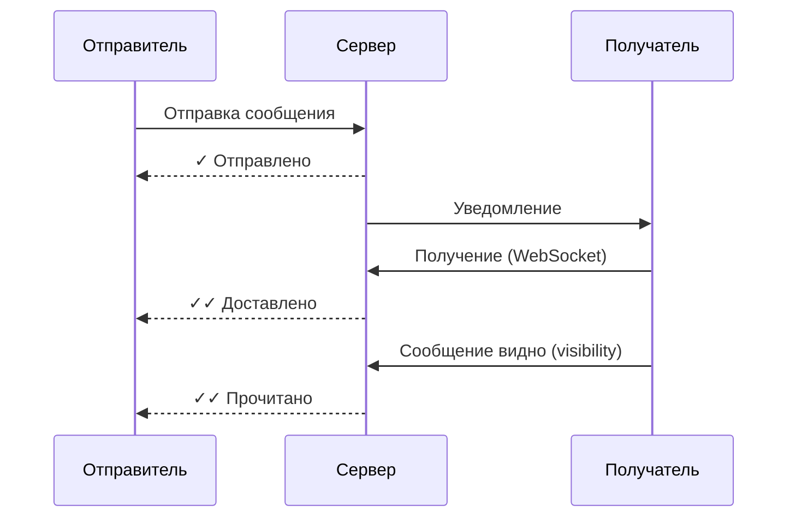

# Отправка сообщений

## Типы сообщений

Ren поддерживает следующие типы сообщений:

| Тип | Описание | E2EE |
|-----|----------|------|
| **Текстовые** | Обычные текстовые сообщения | ✅ |
| **Файлы** | Документы, архивы и т.д. (до 50MB) | ✅ |
| **Изображения** | Фотографии с предпросмотром | ✅ |
| **Голосовые** | Голосовые сообщения | ✅ |
| **Видео** | Видеофайлы | ✅ |

## Отправка текстового сообщения

### Приватный чат

1. Откройте чат с собеседником
2. Введите текст в поле ввода
3. Нажмите **Отправить** (или Enter)

Сообщение шифруется через:
1. Генерацию случайного симметричного ключа
2. Шифрование ChaCha20-Poly1305
3. Создание конверта для получателя (wrap ключа публичным ключом)

### Групповой чат

> **Важно:** Групповые сообщения в текущей версии **НЕ защищены E2EE**. Сервер имеет доступ к plaintext.

1. Откройте групповой чат
2. Введите текст
3. Нажмите **Отправить**

## Отправка файлов

### Через меню вложений

1. Нажмите на иконку **📎** (скрепка)
2. Выберите тип вложения:
   - **Фото/Видео** — галерея или камера
   - **Файл** — файловый менеджер
3. Выберите файл (макс. 50MB)
4. Добавьте комментарий (опционально)
5. Нажмите **Отправить**

### Шифрование файлов

Файлы шифруются аналогично сообщениям:

```
1. Генерация уникального ключа для файла
2. Шифрование ChaCha20-Poly1305
3. Создание метаданных:
   - filename: имя файла
   - mimetype: MIME-тип
   - size: размер в байтах
   - nonce: вектор инициализации
   - enc_file: зашифрованный файл (base64)
4. Отправка метаданных в сообщении
```

### Чанкирование больших файлов

Файлы >50MB разбиваются на чанки:

```json
{
  "chunk_size": 5242880,
  "chunk_count": 3,
  "nonces": ["nonce1", "nonce2", "nonce3"]
}
```

Каждый чанк шифруется отдельным ключом.

## Индикаторы доставки

Сообщения отображаются со статусами:

| Статус | Значок | Описание |
|--------|--------|----------|
| **Отправлено** | ✓ (одна) | Сохранено на сервере |
| **Доставлено** | ✓✓ (две) | Получено собеседником |
| **Прочитано** | ✓✓ (две, цветные) | Прочитано собеседником |

### Как работает



## Редактирование сообщений

1. Нажмите и удерживайте сообщение
2. Выберите **Редактировать**
3. Измените текст
4. Нажмите **Сохранить**

Изменённые сообщения помечаются меткой времени редактирования.

## Удаление сообщений

### Удалить своё сообщение

1. Нажмите и удерживайте сообщение
2. Выберите **Удалить**
3. Подтвердите удаление

> Только автор может удалить своё сообщение.

### Удалить чужое сообщение (admin/owner)

1. Нажмите и удерживайте сообщение
2. Выберите **Удалить для всех**
3. Подтвердите удаление

> Требуется роль admin или owner в групповом чате.

## Пересылка сообщений

1. Нажмите и удерживайте сообщение
2. Выберите **Переслать**
3. Выберите чат для пересылки
4. Нажмите **Отправить**

Сохраняются метаданные источника:
- Оригинальный отправитель
- Дата отправки
- Чат-источник

## Ответы на сообщения

1. Нажмите и удерживайте сообщение
2. Выберите **Ответить**
3. Введите ответ
4. Нажмите **Отправить**

Ответ отображается как ссылка на исходное сообщение.

## Typing indicators

При вводе текста собеседник видит индикатор набора текста.

### Отключение

Настройки → Уведомления → In-app баннеры (выключить)

## Проблемы и решения

### Сообщение не отправляется

**Причина:** Нет соединения с сервером.

**Решение:** Проверьте подключение к интернету. Приложение автоматически переподключится.

### Файл не загружается

**Причина:** Файл слишком большой (>50MB).

**Решение:** Разделите файл на части или используйте облачное хранилище.

### Сообщение не расшифровывается

**Причина:** Проблема с ключами получателя.

**Решение:** Попросите получателя перезайти в приложение.
